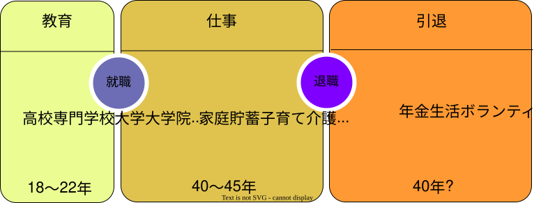
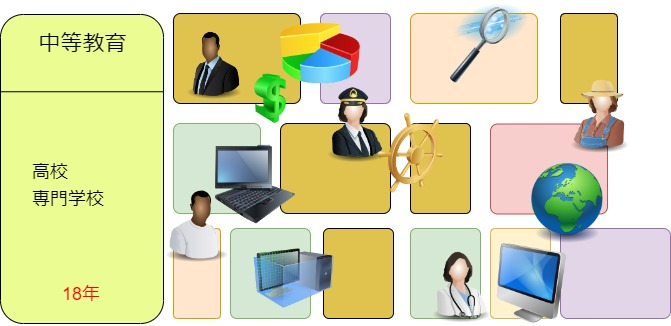
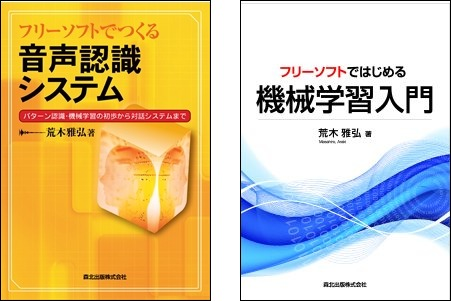
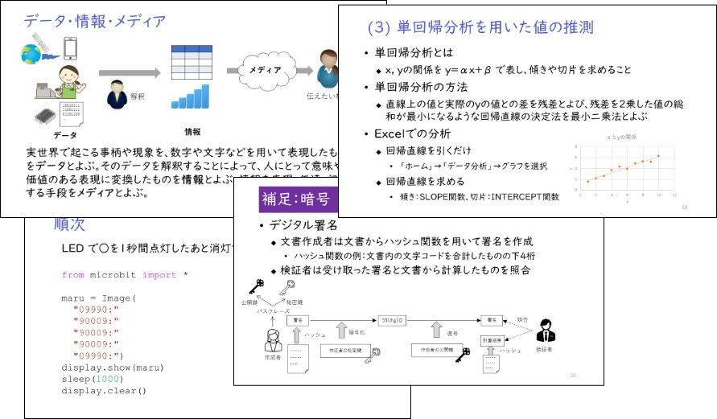

### 現在の社会の状況

「人生100年」および「Society5.0」の時代において、教育・仕事・引退の3ステージライフは破綻をきたしているといえます。たとえば、22歳で大学卒業、65歳で退職すると、就労期間は43年間です。技術が加速度的に進展する現代で、大学卒業時の知識が43年間有効であり続けることは期待できません。

具体的に現在(2022年)の43年前である1979年頃の情報技術を取り巻く状況を振り返ってみます。

- 国内最初期のパーソナルコンピュータ Sharp MZ-80, NEC PC-8001が発売
- 東芝が日本初のワープロJW-10を発売  重さ220kg、価格630万円
- 研究機関等で限定的なコンピュータネットワークは稼働していたが、インターネット標準化は1982年
  - 携帯電話、テレビ電話は夢の技術

この状況から現在に至るまでの変化より、さらにダイナミックな変化が今後起こることが予想されます。

また、退職後の引退ステージがかなり長くなっており、悠々自適で何もしないという生活が40年近く続くという状況はあまり想像できないでしょう。一方で高齢とされる年代においてもデジタル技術を活用して充実した生活をおくれる人々とそうでない人々との間でデジタル格差が広がっているという問題があります。

### 3.5ステージかマルチステージか

このような状況で日本政府は3ステージライフから3.5ステージライフへの移行に軟着陸させようとしているようです（参考：[高年齢者雇用・就業対策](https://www.mhlw.go.jp/stf/seisakunitsuite/bunya/koyou_roudou/koyou/koureisha/index.html)）。60歳半ばの退職後から75〜80歳ぐらいまで、再雇用やボランティア等で活動する0.5ステージにあたる期間を充実させることで、退職と引退の間を「やりがい」で埋めようとしています。これに対して、リンダ・グラットン（Life Shiftの著者）らの提唱するマルチステージライフは、勉強、仕事、子育て／介護、社会貢献などをそれぞれの人生設計に基づいて自由な期間で組み合わせられるようにしようという提案です。

高等学校までの中等教育を終えた（成人年齢に達した）後は、大学に進学して勉強する、就職して活動資金を貯める、早くから家族を持つ、ボランティア活動で見聞を広めるなど、それぞれが自分に適したステージを選ぶ。そして、それぞれのステージを自分の状況に合わせて5年から10年程度の期間で切り替えて生活するというものが、マルチステージライフのイメージです。このようなマルチステージライフは、新しく仕事に就く、あるいは新しく社会活動を始めるに当たって、数ヶ月から1年ぐらいの期間で必要なことを学べるということが可能になってはじめて実現できます。

### 京都工芸繊維大学　社会人教育コース（情報分野）の歩み

今後の日本で3.5ステージライフあるいはマルチステージライフのいずれの状況が主たるライフステージ構成となるとしても、学びたい人がいつでも学べるように制度を整えておくことが必要になります。

このような考えから、2016年度～2018年度に社会人を対象とした履修証明プログラム「機械学習 基本技能習得プログラム」（担当1名で60コマ）を実施しました。

- 履修証明プログラム「機械学習 基本技能習得プログラム」
  - [2016年度](https://www.kit.ac.jp/events/events161011/) (10/11～2017/2/3 火・金 夜間) 京都工芸繊維大学にて実施
  - [2017年度](https://www.kit.ac.jp/events/events170411/) (4/11～8/4 火・金 夜間) 大阪 新ダイビルにて実施
  - [2018年度](https://www.kit.ac.jp/events/events180522/) (5/22～9/18 火・金 夜間) 大阪 新ダイビルにて実施

また、公開講座として2017年度は東京 新丸の内ビルディング 京都アカデミアフォーラムで3日間の講習会「機械学習講座　入門版」と1日の講習会「機械学習講座　概要版」を実施しました。2018年度と2019年度はこれらを大阪でも実施しました。

- 公開講座 「機械学習講習会」
  - [2017年度](https://www.kit.ac.jp/events/events180119/) 機械学習講座 概要版(1日間) 入門版(3日間) 東京 
  - [2018年度](https://www.kit.ac.jp/events/events181026/) 機械学習講座 概要版(1日間) 東京・大阪 / 入門版(3日間) 東京 
  - [2019年度](https://www.kit.ac.jp/events/events190717/) 機械学習講座 概要版(1日間) 入門版(3日間) 東京・大阪

2019年度からは履修証明プログラム「機械学習・IoT・ビッグデータ履修コース」となり、本学情報工学専攻の科目のうちいくつかも受講できるようになりました。文部科学省の履修証明プログラムの制度が変更となり、30コマで履修証明が出せるようになったので、私が担当する機械学習の科目は30コマ分となり、キャンパスプラザ京都で平日昼間に実施しました。その後、2020年度と2021年度はコロナ禍でオンライン実施となりました。

- 履修証明プログラム「機械学習・IoT・ビッグデータ履修コース」
  - [2019年度](https://www.kit.ac.jp/events/events190408/) 機械学習基礎・応用 (5/10～7/11 平日昼間) キャンパスプラザ京都にて実施
  - [2020年度](https://www.kit.ac.jp/events/events200408/) 機械学習基礎・応用 (5/13～7/1 平日午前) オンラインにて実施
  - [2021年度](https://www.kit.ac.jp/events/events210407/) 機械学習基礎・応用 (4/7～6/2 平日午前) オンラインにて実施

また、2021年度は公開講座として以下の2つをオンラインで実施しました。「情報の基本」は2022年度から高等学校で科目「情報I」が必履修となることを受けて開講したものです。

- 公開講座
  - [機械学習入門](https://www.kit.ac.jp/events/events211118/) / [【資料のページ】](https://github.com/MasahiroAraki/MLCourse/tree/master/archive/2021/2021b)
  - [情報の基本 高等学校情報Ⅰが常識になる時代を迎えて](https://www.kit.ac.jp/events/events211119/) / [【資料のページ】](https://masahiroaraki.github.io/Informatics-I/)

2022年度の履修証明プログラムも2021年度と同様に企画したのですが、受講申込者数が定員に達しなかったため開講中止となりました。AI・機械学習は需要が一回りしたような感触です。学ぶべき人は何らかの方法ですでに学んでおり、今後はそういう人たちが継続して学べるような場を提供するべきだと感じています。

### 今後に向けて

社会人向け講座の実施を通じて、基礎の学び直しの需要を感じています。数学では線形代数や統計学、情報関連ではプログラミングや情報デザインなどです。また、より効果的な教育を目指して、オンライン教材の活用やラーニングアナリティクスに関する基盤整備も必要だと感じています。 
