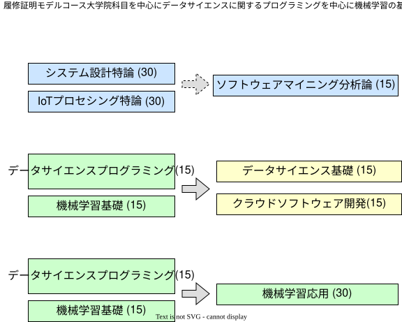

### このページについて

令和5年度に実施される 京都工芸繊維大学 「KITリカレント教育プログラム 機械学習・IoT・ビッグデータ技術履修コース」の内容予告です。非公式の内容なので、正確な情報は大学のホームページで発信される内容をご覧ください。

### 概要

- 参加対象
  - 大学卒業以上。理工系大学初年次程度の微積分・線形代数の知識、または実務でのプログラミング経験があることが望ましい

- 対象科目
  - 情報工学専攻 大学院科目
    - 情報工学の専門科目
    - 4月上旬から6月上旬、および9月下旬から11月下旬にかけて実施
    - 科目により対面、オンライン、ハイフレックスなど実施形態が異なる
  - 本コースのために開講される科目
    - 主としてデータサイエンス・機械学習を対象とした科目
    - 9月下旬から11月下旬にかけて実施
    - 一部対面の場合もあるが、原則としてオンライン受講が可能

- 申し込みの時期
  - 各科目開講の約10日前まで

- 得られる証明等
  - 60時間以上の履修で履修証明書を発行
  - 履修証明書の発行を希望しない場合は、聴講のみの参加も可能

- 受講料：科目毎の受講が可能
  - ～15時間 30,000円
  - 16～30時間  60,000円
  - 31～60時間  90,000円
  - 以降、1時間毎に1,000円追加
  - （ただし、1時間は「45分の講義・演習」+「15分の自習時間」として計算します）

### 科目

- システム設計特論 [2022年度シラバス](https://www.syllabus.kit.ac.jp/?c=detail&pk=1789&schedule_code=62201501)
- IoTプロセシング特論 [2022年度シラバス](https://www.syllabus.kit.ac.jp/?c=detail&pk=1794&schedule_code=62201201)
- ソフトウェアマイニング分析論 [2022年度シラバス](https://www.syllabus.kit.ac.jp/?c=detail&pk=1797&schedule_code=62215201)
- データサイエンスプログラミング ※新規開講科目
- 機械学習基礎 [2021年度の資料](https://github.com/MasahiroAraki/MLCourse/tree/master/archive/2021/2021%E5%B1%A5%E4%BF%AE%E8%A8%BC%E6%98%8E)
- 機械学習応用 [2021年度の資料](https://github.com/MasahiroAraki/MLCourse/tree/master/archive/2021/2021%E5%B1%A5%E4%BF%AE%E8%A8%BC%E6%98%8E)
- データサイエンス基礎 [2022年度の内容](https://www.kit.ac.jp/wp/wp-content/uploads/2022/08/Data-Science-Basics_Schedule.pdf)
- クラウドソフトウェア開発 [2022年度の内容](https://www.kit.ac.jp/wp/wp-content/uploads/2022/08/Cloud-Software-Development_Schedule.pdf)

### モデルコース

